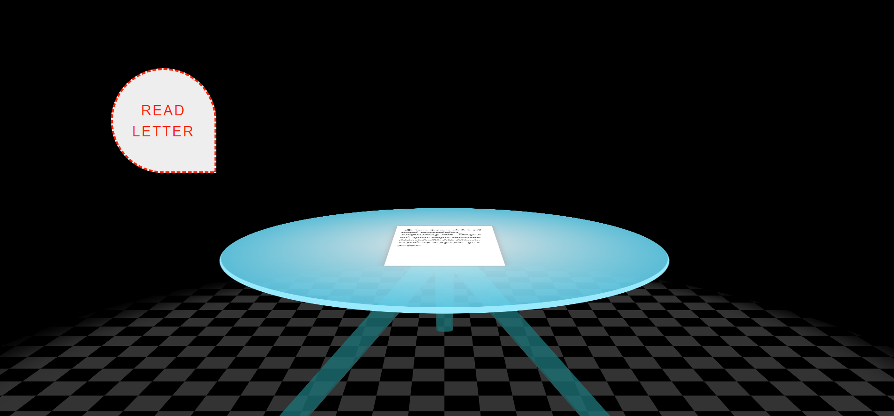

# 3DRoom

## Description
In this project a 3d room is create using HTML and CSS.  The room contains a table with a letter on the table. Above the table is a button that tells the user to click the button to read the letter.  When the user clicks on the button the camer zooms closer to the screen and the letter sits upright allowing the user to get a full view of the text.  When the button is clicked again the letter returns to its original position on the table and the camera returns to its original position.  This effect is acheived by using an eventlistner on the button that toggles classes on the table and on the letter that changes both items position on the screen.

## Demo
A live demo of this project can be found at:  https://tod619.github.io/3DRoom/
